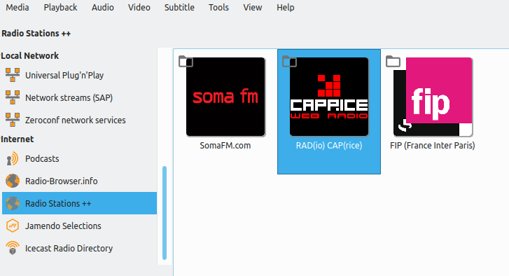
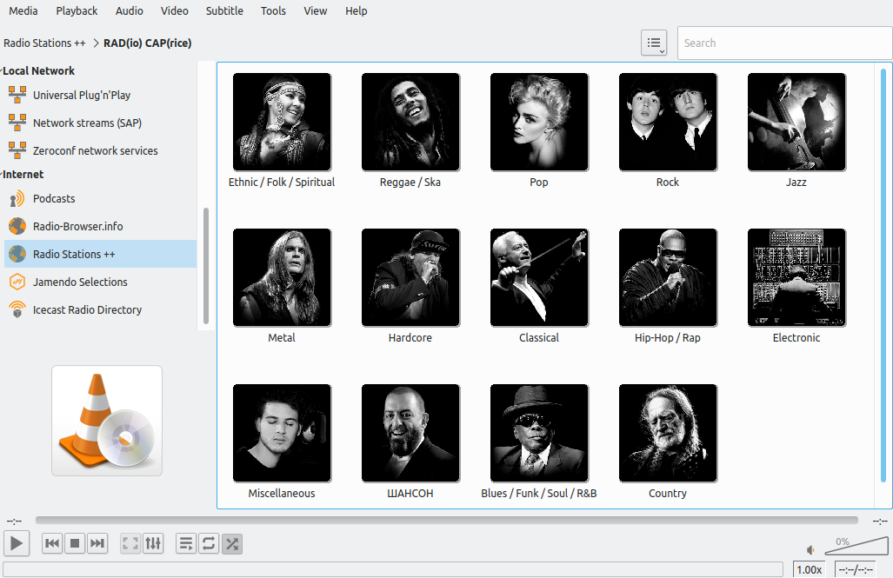
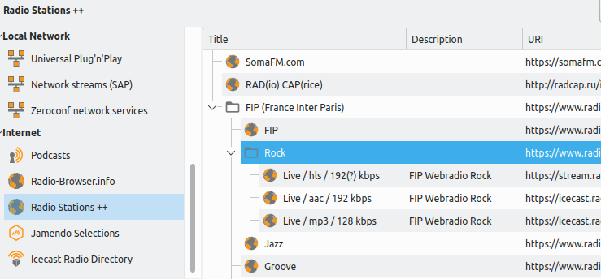

# VLC Radio Stations ++ Add-on

Various Radio Stations (and their various substations) as VLC Service Discovery addon (lua script):
* SomaFM - https://somafm.com/
* FluxFM - https://www.fluxfm.de/
* FluxFM (beyond) - https://streams.fluxfm.de/
* Rad(io) Cap(rice) - http://www.radcap.ru/
* FIP (France Inter Paris) - https://www.radiofrance.fr/fip

---
**SCREENSHOTS**:

Icon view:

List view:

---
 This program is distributed in the hope that it will be useful,
 but WITHOUT ANY WARRANTY; without even the implied warranty of
 MERCHANTABILITY or FITNESS FOR A PARTICULAR PURPOSE.  See the
 GNU General Public License for more details.

**BUGS & REQUESTS**:

Send me a message or open a ticket on github: https://github.com/Radio-Guy

---
**UPDATES**:

20230217: v0.63 1) SD: Included FluxFM and FluxFM (beyond) (the latter includes even more radio streams than listed on the main website), 2) Minor beauty fixes

20230208: v0.62 1) SomaFM: Removed web player item inclusions, 2) RedCap: Fixed streaming server retrieval bug

---
**INSTALLATION**:

Put the sd_xxx.lua file into the according Service Discovery subfolder of the VLC lua directory—by default:
* Windows (all users): %ProgramFiles%\VideoLAN\VLC\lua\sd\
* Windows (current user): %APPDATA%\VLC\lua\sd\
* Linux (all users): /usr/share/vlc/lua/sd/
* Linux (current user): ~/.local/share/vlc/lua/sd/

Put the pl_xxx.lua files into the according Playlist subfolder of the VLC lua directory—by default:
* Windows (all users): %ProgramFiles%\VideoLAN\VLC\lua\playlist\
* Windows (current user): %APPDATA%\VLC\lua\playlist\
* Linux (all users): /usr/share/vlc/lua/playlist/
* Linux (current user): ~/.local/share/vlc/lua/playlist/

You will need to place both the sd_xxx.lua as well as the pl_xxx.lua files for this addon to work.

Create the directories if they don't exist.

Restart VLC.

---
**EXPLANATION & USAGE**:

* This Service Discovery is available on the left panel of VLC under "Internet" >> ""Radio Stations ++"
* Each radio station offers several substations, various formats and sometimes several streaming servers.
* Activate the *Album* and *Description* columns in VLC—they will hold some valuable information, e.g. a popularity to sort on for SomaFM. 
* If you are in thumbnail view, you will receive some nice and convenient station icons. They will however only appear once you entered into the main station. Also, substation thumbnails for SomaFM are buggy and not displayed anymore—if anyone can resolve this bug, please contact me on Github.
